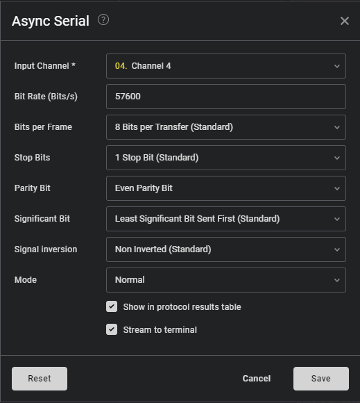

import Challenge from '@/components/Challenge.astro'
import Callout from '@/components/Callout.astro'
import { Icon } from 'astro-icon/components'

## An4lyz3-1t [HW]

### Challenge description
<Challenge
  title="An4lyz3-1t"
  authors={['Chainfire73']}
  category="hardware"
  flag="ACSC{b4by4n4lyz3r_548e8c80e}"
>
  I wonder if this program leaks enough information for you to get the flag with
  less than 2048 queries... It probably does. I'm sure you can figure out how.
</Challenge>

### Solution

Provided the logic file and a great hint that it's a serial communication  To get the communication we just need to set the correct serial analyse and we get the flag. 

Required some baud rate brute forcing to get the correct one.

<Callout variant='note'>
The standard baud rates are: 4800, 9600, 19200, 38400, 57600, 115200, 230400, 460800, 921600
</Callout>

