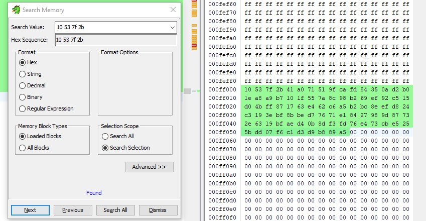

import Challenge from '@/components/Challenge.astro'

<div class="invisible h-0! [&+*]:mt-0 [&+*_*]:mt-0">
## picopico [HW]
</div>

### Challenge description
<Challenge
  title="picopico"
  authors={['op']}
  category="hardware"
  flag="ACSC{349040c16c36fbba8c484b289e0dae6f}"
>
Security personnel in our company have spotted a suspicious USB flash drive. They found a Raspberry Pi Pico board inside the case, but no flash drive board. Here's the firmware dump of the Raspberry Pi Pico board. Could you figure out what this 'USB flash drive' is for?
</Challenge>

### Solution

#### Analyzing the firmware
Performing a simple `strings` on the provided `firmware.bin` reveals some interesting Python code:

```ansi
$ strings firmware.bin
...
import time
L=len
o=bytes
l=zip
import microcontroller
import usb_hid
from adafruit_hid.keyboard import Keyboard
from adafruit_hid.keyboard_layout_us import KeyboardLayoutUS
from adafruit_hid.keycode import Keycode
w=b"\x10\x53\x7f\x2b"
a=0x04
K=43
if microcontroller.nvm[0:L(w)]!=w:
 microcontroller.nvm[0:L(w)]=w
 O=microcontroller.nvm[a:a+K]
 h=microcontroller.nvm[a+K:a+K+K]
 F=o((kb^fb for kb,fb in l(O,h))).decode("ascii")
 S=Keyboard(usb_hid.devices)
 C=KeyboardLayoutUS(S)
 time.sleep(0.1)
 S.press(Keycode.WINDOWS,Keycode.R)
 time.sleep(0.1)
 S.release_all()
 time.sleep(1)
 C.write("cmd",delay=0.1)
 time.sleep(0.1)
 S.press(Keycode.ENTER)
 time.sleep(0.1)
 S.release_all()
 time.sleep(1)
 C.write(F,delay=0.1)
 time.sleep(0.1)
 S.press(Keycode.ENTER)
 time.sleep(0.1)
 S.release_all()
time.sleep(0xFFFFFFFF)
...
```

This python code seems like a Rubber Ducky script that performs the following actions when the device is plugged in:

```python showLineNumbers=false
Press Win + R -> Types 'cmd' -> Press Enter key -> Type variable F -> Press Enter key
```

#### Finding F

The below code snippet makes up the variable F.

```python showLineNumbers=false
import microcontroller
w=b"\x10\x53\x7f\x2b"
a=0x04
K=43
if microcontroller.nvm[0:L(w)]!=w:
 microcontroller.nvm[0:L(w)]=w
 O=microcontroller.nvm[a:a+K]
 h=microcontroller.nvm[a+K:a+K+K]
 F=bytes((kb^fb for kb,fb in zip(O,h))).decode("ascii")
```

Taking a look at the documentation for [microcontroller.nvm](https://docs.circuitpython.org/en/latest/shared-bindings/nvm/index.html), we can see that it return a part of the non-volatile memory as a bytearray. And, we can get the bytes that make up the NVM from the extracted firmware that was given to us. 

So, simply searching up for "10 53 7f 2b" in the firmwares hexdump, we get the bytes we're looking for.


#### solve.py

```python showLineNumbers=false
j = b'\x10\x53\x7f\x2b\x41\xa0\x71\x51\x9f\xca\xfd\x84\x35\x0a\xd2\xb0\x1e\xa8\xa9\xb7\x10\x1f\x55\x7a\x8c\x98\xb2\x69\xef\x92\xc5\x15\xd0\x4b\xff\x87\x17\x63\xe4\x62\xc6\xa5\xb2\xbc\x8e\xef\xd8\x24\xc3\x19\x3e\xbf\x8b\xbe\xd7\x76\x71\xe1\x84\x27\x98\x9d\x87\x73\x2e\x63\x19\xbf\xae\xd4\x0b\x8d\xf3\xfd\x76\xe4\x73\xcb\xe5\x25\x5b\xdd\x07\xf6\xc1\xd3\xd9\xb8\x89\xa5'

k = j[4:47]
l = j[47:90]

F = bytes((kb^fb for kb,fb in zip(k,l))).decode("ascii")

print(F)
```
