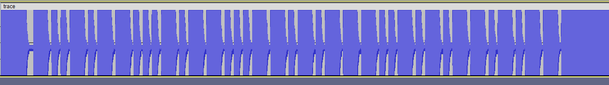
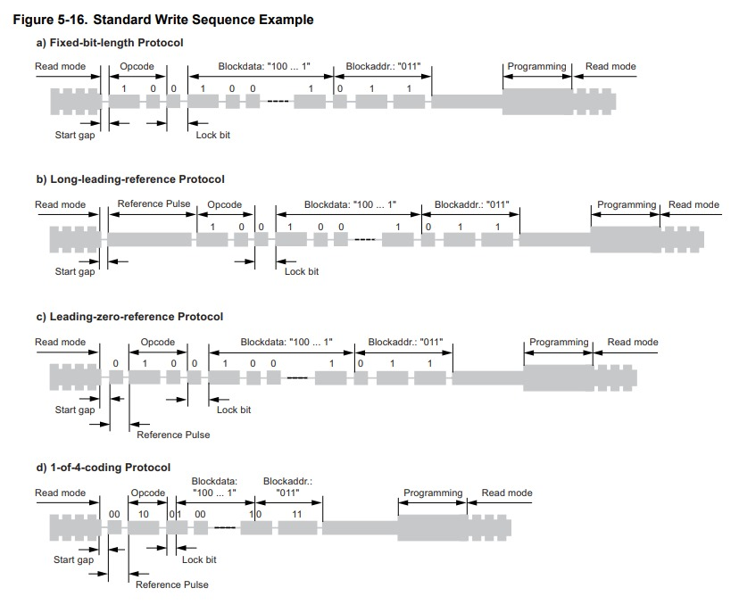

import Challenge from '@/components/Challenge.astro'

<div class="invisible h-0! [&+*]:mt-0 [&+*_*]:mt-0">
## RFID_Demod [HW]
</div>

### Challenge description
<Challenge
  title="RFID_Demod"
  authors={['Chainfire73']}
  category="hardware"
  flag="ACSC{B1635CAD}"
>
We have obtained analog trace captured by sniffing a rfid writer when it is writing on a T5577 tag. Can you help us find what DATA is being written to it?

Flag Format: `ACSC{UPPERCASE_HEX}`
</Challenge>

### Solution

At first, I confused it with the trace files that a proxmark stores. Later, after quite long, when nothing worked out, taking a closer look at the wav file, something stood out.  

### Initial Analysis 
I opened the file on Audacity to take a look at it. 
At a first glance, it seemed like noise. Zooming in a bit, we can see some patterns.



To understand the format of the signal, I had to dig up the datasheet and find something that made sense of this trace.
The datasheet can be found on [proxmark3's github](https://github.com/RfidResearchGroup/proxmark3/blob/master/doc/T5577_Guide.md#introduction)



### Getting the DATA bits
Manually writing and separating the bits according to the datasheet. 

```data showLineNumbers=false
10 0 10110001011000110101110010101101 011
     |<----------- data ----------->|   
```

Converting this to UPPERCASE_HEX, we get `B1635CAD`.
