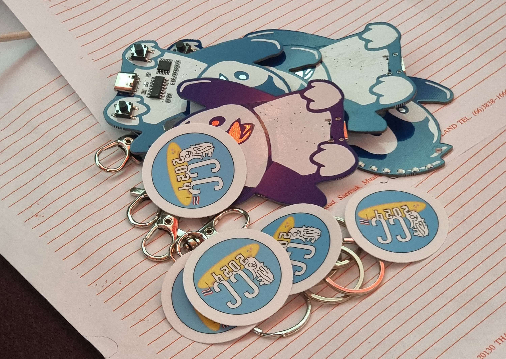
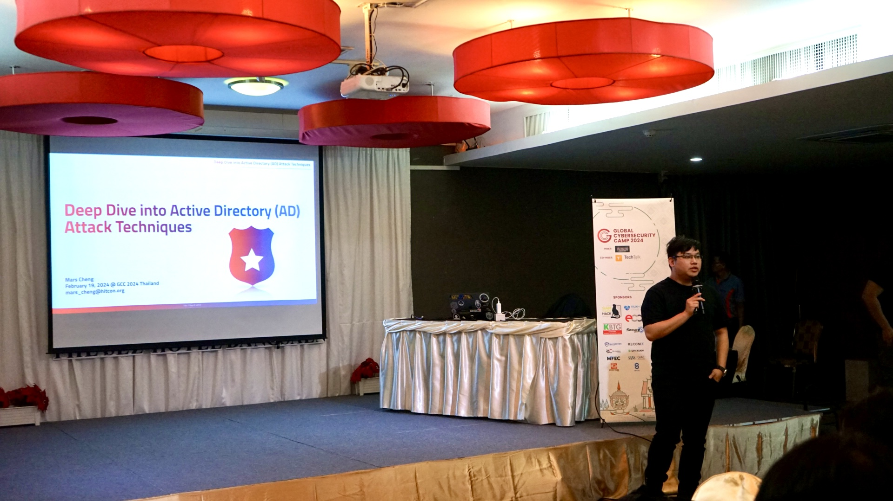

## Day 1: Opening, Ethics and AD attacks

On the first day of the event, I woke up, got ready, and went for breakfast, not knowing that it was going to be my last proper breakfast for the rest of the week. All the students were divided into groups of five. I was in **Group 1** along with Danisy[MY], Solbin[KR], Ryan[IDN] and ShallowFeather[TW]. It was a wonderful experience being their group member, as we got to learn more about each others culture. Danisy and Solbin vibed on K-pop, and overall the atmosphere was very pleasant.

The opening ceremony was conducted by Bank and Karin, the TH staff, who explained the rules. This was followed by two opening talks: one by **Khun Mon** from [CCIB](https://ccid4.ccib.go.th) and another by **Joshua James** from [UNODC](https://www.unodc.org). Both of them discussed the recent trends in cybercrime and the challenges faced in preventing it.
We also had another interesting session on Ethics, taken online by **Bhume Bhumiratana**.

After the talks, we were assigned topics for our group projects. The topics were:
1. CTF Challenges
2. Maltego plugin for analysis of Mobile Phone Dumps
3. CVE and Exploit Database
4. Analysis of OSINT feeds for Scams

I had initially hoped for "CVE and Exploit Database" as I had already worked on a similar project earlier. However, my group got the Maltego plugin which  none of us had experience with. It turned out to be something new to learn and was exciting in its own way.

We then broke for lunch. While we were eating, Team Singapore dropped some stickers and Penguin Hardware Badges made by Manzel. Thank you!

Then we started our first training: **AD Attacks**.

---

### Deep Dive into Active Directory (AD) Attack Techniques - Mars Cheng [TW]
This was completely new for me: I had only heard that AD is used by organisations like companies and colleges to manage user accounts. I was looking forward to the session even though I knew I wasn't going to keep up with everything.

We started by setting up the AD on our system — and yes it took time. We were given 6 labs to complete in the session, out of which I managed to finish 4. We covered exploitation methods such as infiltration, lateral movement, Kerberoasting, and more. We had 3 VMs running on our laptops and I was surprised my laptop could handle it. 

Later, Mars said that this was only part of a 20-lab course and everyone was like 💀
This training taught me a lot about AD attacks and I will surely look into it.

---

After the session, we were all exhausted trying to process all the knowledge, so we went to have dinner and take a short walk outside the hotel. My group had planned to meet agian after dinner to discuss about our Maltego project. We set up a Notion page where we could share ideas and resources we find online. Progress was slow, since we were all working with a completely new tool and also had to figure out how to build a plugin for it.