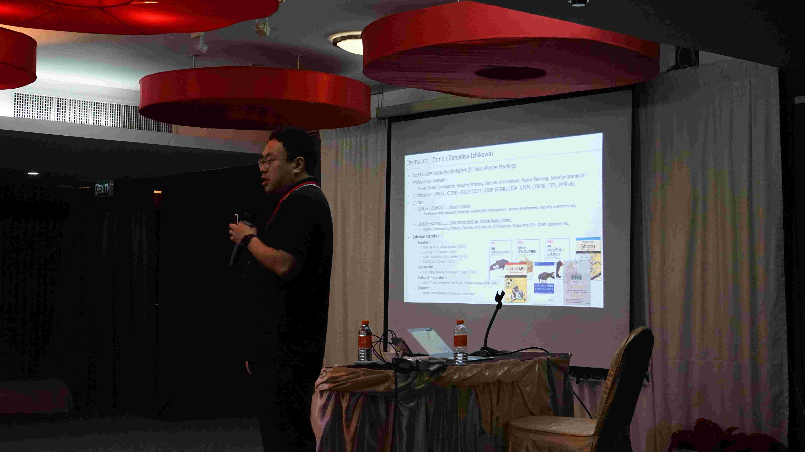
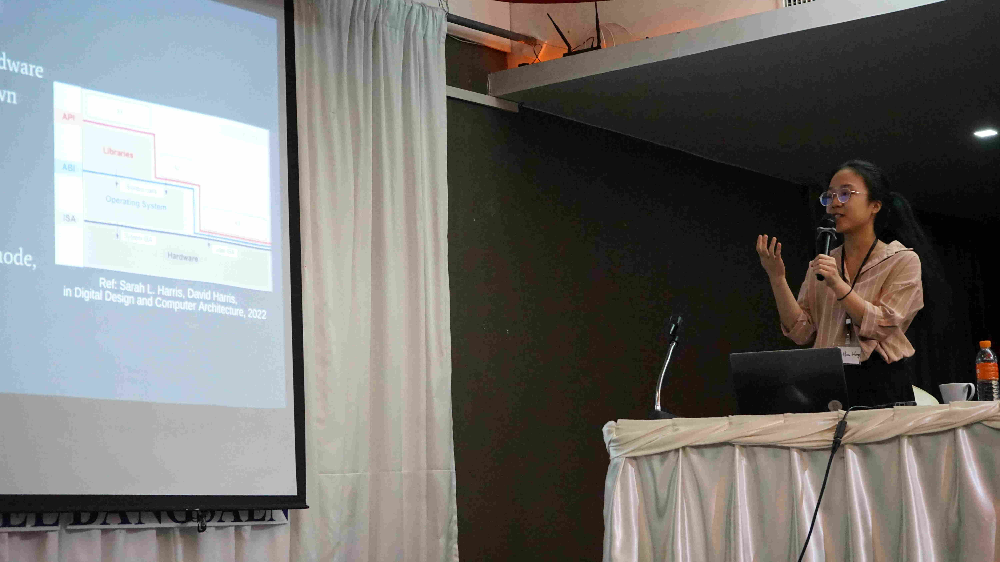

## Day 2: Threat Intelligence and Fuzzing

Early in the morning, we started with the Threat Intelligence session.

---

### Handling Threat Intelligence - Tomohisa *'Tomo'* Ishikawa  [JP]
This was my first time learning about Threat Intelligence. It was on the blue teaming side, which I had never really explored. Tomo had AWS environments setup for us, which contained some labs. 

The labs involved writing [YARA](https://www.malwarebytes.com/blog/news/2017/09/explained-yara-rules) rules for malware and then the same on other files. The main goal was to determine if they belonged to the same malware family while avoiding false positives. 

It was an engaging session, and I was able to follow alogn the entire process. The [YARA documentation](https://yara.readthedocs.io/en/stable/) is an excellent resource. 

---

During the sessions, everyone shared the snacks they got from their home countries. *We're asians — of course we love snacks.* 

We then broke for lunch, after which we had a session on Fuzzing. I was really excited on attending this session as I had recently started working with fuzzers to finding vulnerabilities.

---

### Fuzzing in the Kernel World - Yi-Han *'Lisa'* Wang [TW]
This talk was given by a GCC 2020 alum who's a member of [Balsn](https://balsn.tw).
She began by explaining how fuzzers work and dove into low-level details. I had some prior knowledge, so I was able to follow most of it, but there was still so much to learn. 

She prepared some labs for us (and we didn't even have to set it up locally). The first lab was to set up [AFL++](https://github.com/AFLplusplus/AFLplusplus) on the system and fuzz our own code, which contained an `abort` call. After that we moved on to fuzzing an older version of **xpdf** with the goal of identifying an actual CVE. She discussed about virtualization and why it's important — I found myself a bit lost there so I have to read up on it.

The main part was kernel fuzzing. We compiled the Linux kernel and were tasked with writing a vulnerable kernel module. That module was then tested with a fuzzing tool named **Syzkaller**, designed to discover kernel bugs by automatically supplying inputs. Lisa explained the basics of kernel fuzzing and what kernel modules do.
I really enjoyed the session and learned a lot.

---

After those very informative sessions, I went out for a breather. After dinner we had another group meeting about the project and sketched out methods for getting dumps from Android devices. We made sure to automate the entire process and make it work across different Android phones. We made some progress on the workflow, but we hadn't built the plugin yet. 