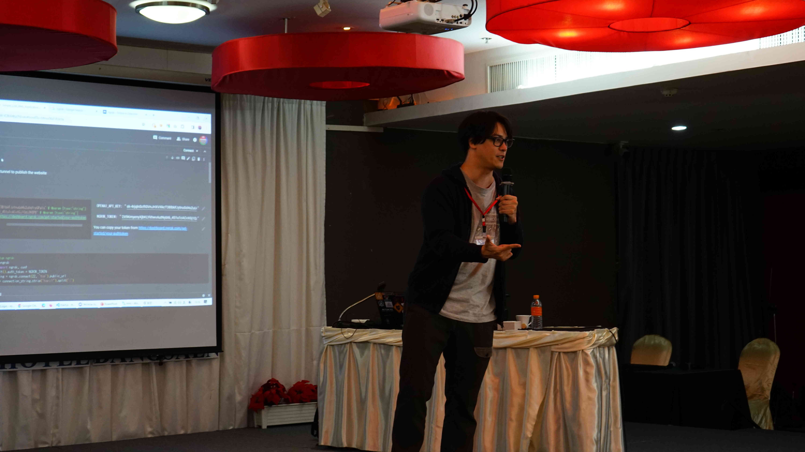
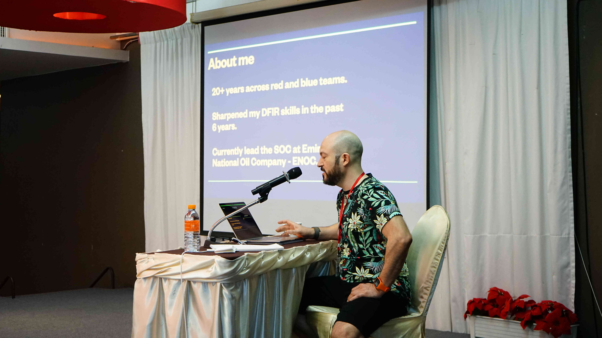

## Day 3: Vulnerable LLM web apps and Velociraptor

First session of the day was on vulnerable LLM web apps. LLMs are a hot topic right now so I was looking forward to the session. 

---

### How (not) to build a vulnerable LLM web app - Shota Shinogi [JP]
This session was taken by **Shota Shinogi**, the creator of [ShinoBot](https://github.com/Sh1n0g1/ShinoBOT), a malware simulator. He has also presented talks at major conferences like DEFCON and BlackHat.

He began by showing us just how easy it is to bypass the instructions of an LLM, you can simply tell it to ignore its original prompt and follow yours instead. The entire room was stunned, *“Wait, we can actually do that?”* This live demonstration made us realize how fragile and exploitable these systems can be.

To put this into practice, he had prepared a CTF environment with LLMs running behind simple web apps. Our task was to use prompt injection techniques to get the flags. Some were quite straightforward, while others required a bit more creativity and wording.

After the CTF, sh1n0g1-san gave us something unexpected, his own GPT-4 API key. With it, we could deploy our own LLM web apps and try to exploit them. Danisy an I got the opportunity to present our vulnerable LLM webapp, **NeverGonnaLose**, in front of everyone too. The exercise wasn't just about breaking things, it was also about building secure defenses like learning how to restrict input, sanitize prompts, and set up guardrails.

This session was very fun and different from all the sessions I had attended. For me, it easily makes it into the **Top 3 sessions of GCC**.

---

Next up was a Forensics session on Velociraptor.

---

### Hunting with a Dinosaur - Andreas van Leeuwen Flamino [NL-AE]
This session engaged us in threat hunting through Windows event logs using a tool called Velociraptor. We worked on a few labs built around a storyline scenario, where we had to trace the point of intrusion across several machines. Although forensics isn't my primary area of interest, it was still a pretty interesting talk, as I got to see and experience a real forensics workflow.

---

I had dinner and then our group met again to discuss the project. By that time I had developed a script that automatically dumps data from Android devices. We started building the plugin/transform and made some solid progress on the project. We left creating the presentation for the last day.