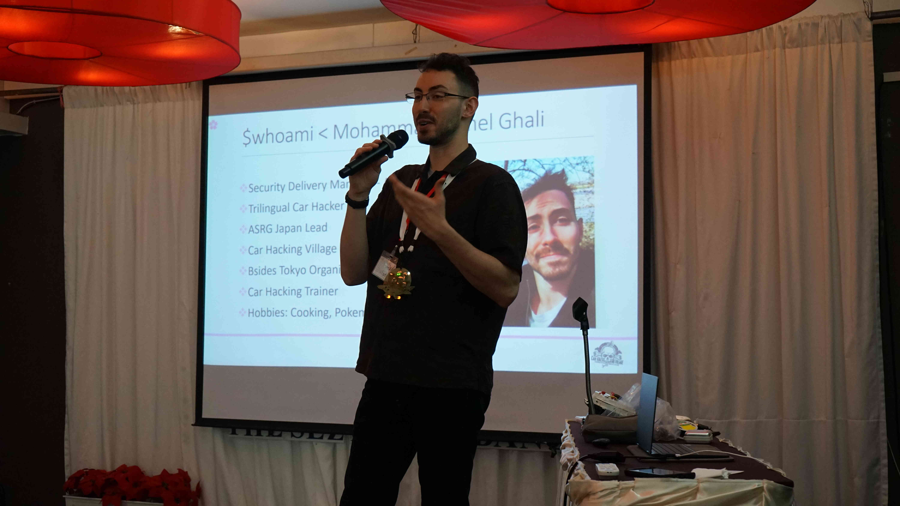
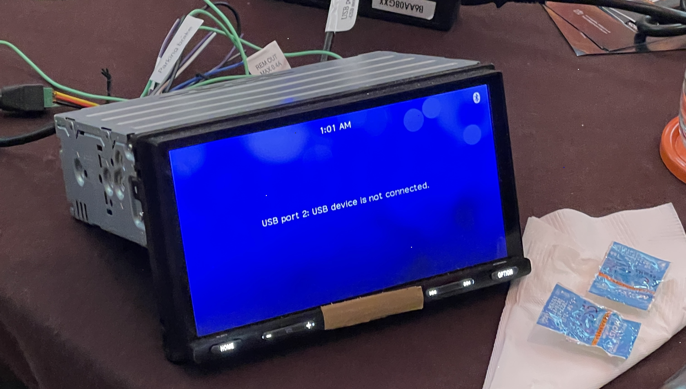
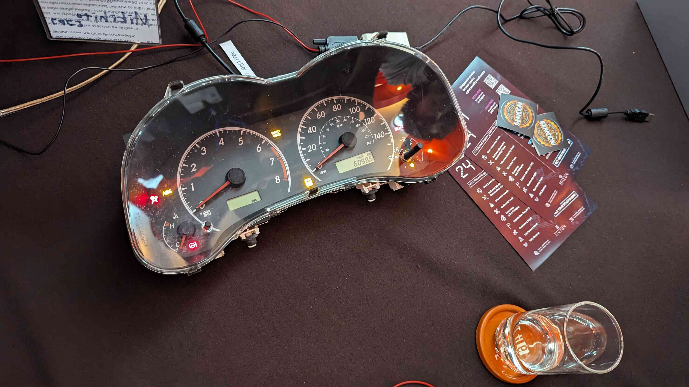
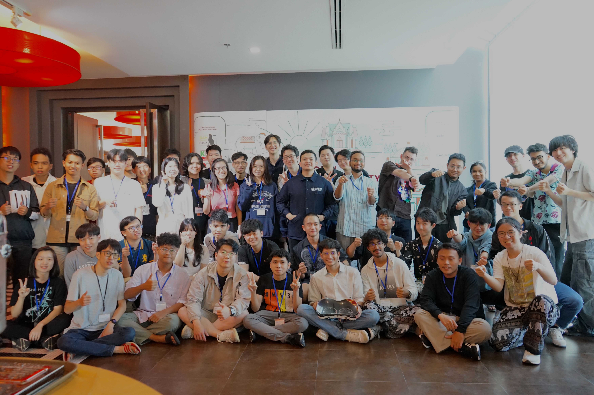

## **Day 4:** Hands-On Car Hacking 

The session I had been waiting for so eagerly, **Hands-On Car Hacking**, and it was finally here. 

---

### Hands-On Car Hacking - Kamel Ghali [JP]
This guy was one of the most fun, goated trainers I've had so far — incredibly knowledgeable and clearly experienced (he's also part of the **Car Hacking Village**).

He started off by showing videos of real-life car hacks as example, then introduced us to a car's internal network. Next came Bluetooth hacking, he'd prepared devices for recon, and because I'd already set up my VM, I was able to carry out the lab exercises perfectly. 

He then taught us about CAN networks. I had some prior knowledge, so I was able to follow along easily, and appreciated that the VM he provided already had **ICSim** preconfigured (it can be a hassle to set it up otherwise). 

The hands-on portion was on another level, he'd set up a physical CAN network into the hall so we could communicate over the interface. But the best part was the real hardware — a full **infotainment system** and an **instrument cluster** to hack into, and yes, I actually managed to get into them. It was an amazing, practical session that gave me real confidence in car-hacking techniques.

This was hands down the best session I got to attend — nothing like anything I've ever been to before. Huge thanks to Kamel for such an amazing and memorable session.

--- 

After this we had an Industrial Session where we met the sponsors from other countries. They were offering internship opportunities and handing out cool swag and merch. 

This was our last day to prepare the project. We completed one plugin, but it didn't feel sufficient, we were only analysing dumps from  non-rooted phones. So I took it upon myself to build another plugin that could extract data from rooted phones and perform OSINT on that data as well.