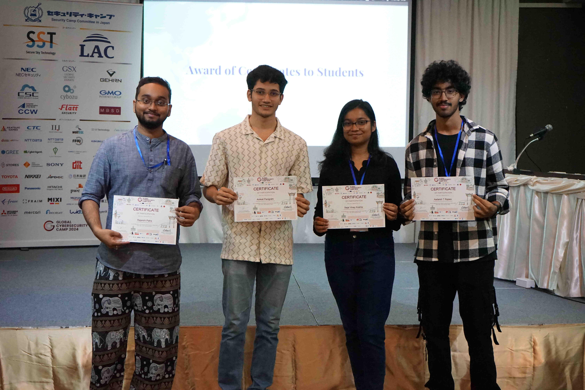

## **Day 5:** The Last Day ft. Malware Analysis 

The last day had finally come, and we couldn't comprehend how fast the week had gone by. The first half was dedicated to a session on Malware Analysis.

---

### Practical Malware Analysis and .NET Reversing - Wei-Chieh Chao[TW] and Yi-Hsien Chen[TW]
This was another session I was looking forward to as I had recently started diving into Malware Analysis. Since the session began with the basics, I was able to follow along smoothly and work through the labs they had prepared. focused on analysing a well-known real-world malware called **RedLine**, and the trainers had even set up a CTF platform where we could submit flags from each lab. 

The session was not only engaging but also highly practical. I learned several techniques that will definitely strengthen my malware analysis skills.

---

### Project Presentation and Closing Ceremony

After this, we had lunch and moved into the final stretch of completing our project. We finalized the presentation, polished up the two plugins, and submitted everything to the judges. The last task was to present our project in front of everyone, where we had only **5 minutes**.

We also received our certificates for attending GCC. Woohoo!

### Farewell, GCC
GCC was truly an incredible experience. I learned so much in such a short span of time, and the exposure to different cultures and people was invaluable. I made friends from all over Asia, and we bonded over our shared passion for cybersecurity. After the event wrapped up, we even had some free time to relax, explore and party.

  

    
  

  

    
  

The next day, we had to leave for the airport. On the way, we stopped by a few local markets and also a bay.

  

    
  

  

    
  

