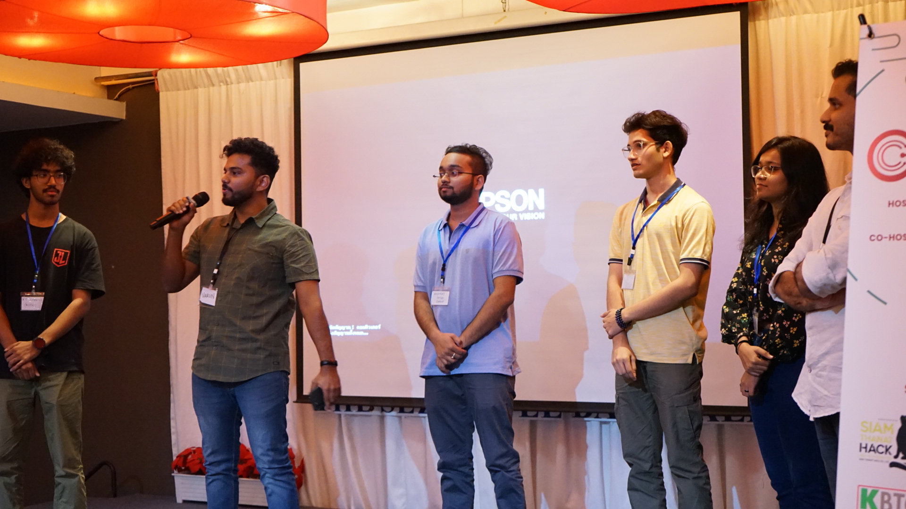
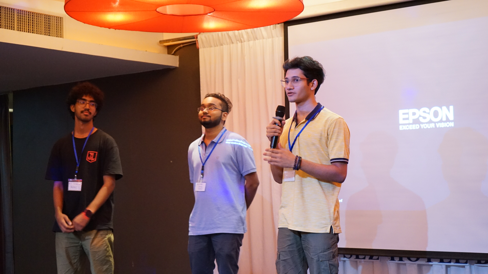

import Subpost from '@/components/Subpost.astro'
import { Icon } from 'astro-icon/components'

## Prologue
**India** had the privilege of joining the [Global Cybersecurity Camp (GCC)](https://gcc.ac/archive/gcc_2024/) this year, and I was honored to be one of the representatives. In this blog, I'll share my journey and experiences from the camp along with some technical nit bits. 

## The Selection Process
A nationwide CTF was organized in India where undergrad students from all the top ranking universities participated. The CTF was held for 6 hours and the top 5 students were to be selected to represent **Team India** at GCC.

I managed to clutch in to the top 5 ranks in the CTF and was happy to get selected for attending the camp. Yay! 🎉

## My Travel
### Init
I had my 3rd semester classes going on at the time, but I got all the required permissions and set off for **Cochin International Airport**. It took me three hours to reach the airport. I met Aadarsh, my senior, who was also selected to attend GCC and was also travelling on the same flight with me. 

### Arrival at Thailand
We landed in Thailand and completed immigration and baggage collection by 5:00 AM (UTC+7). At the DMK Airport, we met all the members of Team India. We were 6 in total — 4 students and 2 staff members.
*Enter Gong.* A TH staff (and a really cool guy), he picked us up from the airport and arranged our ride to the hotel where the event was taking place. We had so much fun on the way, all thanks to him. He made sure we faced no difficulties and even introduced us to some local thai food at the place where we stopped by to have breakfast.

### Arrival at The Sez Hotel, Bangsaen
The van dropped us around 750m away from the hotel since a marathon was going on and the road was blocked. As soon as we got out and picked up our bags to walk to the hotel, we saw Team Japan arrive as well. We were the first two teams to reach the venue.

Unfortunately, we did not get our rooms right away, so we had to wait in a conference hall along with Team Japan. After a while, we decided to step out to a nearby 7-Eleven convenience store to buy Thai SIM cards. We also went on a stroll on the beach before going back to the hotel, where we had a chat with Team Japan and their students. Yuma became a good friend of mine and we still keep in touch even after the event. A few members from Team Japan including Kana-san, joined us for lunch.

That day, the [IRONMAN Triathlon](https://www.ironman.com/im703-bangsaen) was going on and it was a sight to see all the participants giving their all, really motivating and inspiring.

After a couple of hours more teams began to arrive at the hotel and we finally got our rooms. Instead of staying with our own teammates, we were paired with students' from other countries' teams. My roommate was Firdaus from Malaysia.

## And the camp begins...
### Ice-breaking Party 🎉
Once all the teams had arrived and settled in, a grand dinner was held in the main hall. I went around and spoke with a few people before the introductions began. During dinner, each team was called up to introduce themselves. Most of the teams had prepared a presentation, but we hadn't.

We got to meet many cool people, there were people who had great achievements like CVEs, winners at DEFCON Finals Everyone was very humble and they did not make us feel like it was our first GCC. 

### Days at the Camp
The camp was a 5-day long event filled with various training sessions, workshops, and collaborative projects. Each day was packed with activities that expanded our knowledge in cybersecurity and also tested us with practical challenges.

<Subpost title="Day 1: Opening, Ethics and AD attacks" href="/blog/gcc2024-thailand/day1" />
<Subpost title="Day 2: Threat Intelligence and Fuzzing" href="/blog/gcc2024-thailand/day2" />
<Subpost title="Day 3: Vulnerable LLM web apps and Velociraptor" href="/blog/gcc2024-thailand/day3" />
<Subpost title="Day 4: Hands-On Car Hacking" href="/blog/gcc2024-thailand/day4" />
<Subpost title="Day 5: The Last Day ft. Malware Analysis" href="/blog/gcc2024-thailand/day5" />

## **Epilogue: A Vote of Thanks**
- Thanks to GCC organisers to invite India to be a part of GCC.
- Thanks to Vipin Sir, who made it possible for India to be a part of GCC.
- Thanks to the trainers, they took very informative and engaging sessions.
- Thanks to the amazing photographers, who captured some amazing moments that I could add in this blog.
- Thanks to my group members, who worked with me on the project and also helped with the presentation so that I could present smoothly.
- Thanks to everyone at GCC to make this a great experience.
