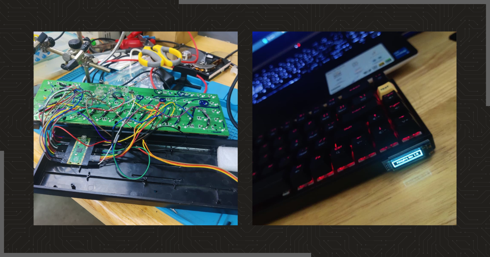

import Callout from '@/components/Callout.astro'
import { Icon } from 'astro-icon/components'

## Story Time
I'll give a bit of a backstory before I get explaining. A few months ago, my senior bought a mechanical keyboard from Amazon, specifically the `Cosmic Byte Artemis 68`. It was a pretty standard keyboard with brown switches and RGB lighting. Well, unfortunately, while performing a firmware update, his loose wire got disconnected and ended up with a bricked keyboard. He tried to fix it for a while but could not do much and gave up. 

*Now, I got my hands on a spare bricked keyboard which was as good as paperweight.*

I knew that Raspberry Pi Pico could be used as an HID device (I made a simple rubber ducky once :P) so I went ahead and started searching if something like a keyboard had been made. Of course some amazing people out there have done the same already, better yet they've made a full keyboards completely from scratch.

## Tinkering with the Keyboard
I opened up the keyboard and took out the PCB to see the layout. I could clearly see the matrix of switches and could identify the rows and columns. Using a multimeter I checked the continuity between the switches and the pins on the PCB. After a while, I was able to map out the rows and columns of the keyboard matrix.

Mapping out the rows and columns was a bit tedious but I trusted my senior [Abhijit CB]() to do the soldering and mess with the board. 

## The Process
With the tinkering done, I moved on to making it a keyboard. I had to use the [CircuitPython HID library](https://circuitpython.readthedocs.io/en/latest/shared-bindings/usb_hid/) to make the Pico act as a keyboard. The library is pretty straightforward and easy to use.

### Turning the Pico into an HID
First, I had to install CircuitPython on the Pico to get the HID capabilities. Following the [official guide](https://circuitpython.org/board/raspberry_pi_pico/) to do is easy and very easy to get started with Circuit Python. Once you have CircuitPython installed, you can copy the `adafruit_hid` library to the `lib` folder on the Pico.

This sets out base for the project. I used **Thonny IDE** to write the code and upload it to the Pico.

### Act as a Keyboard
To make the Pico identify as a keyboard, I need to assign the keyboard device identifier from the `usb_hid.devices` list. 

```python showLineNumbers=false
import usb_hid

keeb = None
for dev in list(usb_hid.devices):
    if ( (dev.usage == 0x06) and
        (dev.usage_page == 0x01) and
        hasattr(dev, "send_report") ):
        keeb = dev
if keeb == None:
    raise Exception("Device cannot be found")
```

### The Keyboard Matrix
The keyboard I am working on doesn't follow the conventional layout. So, I had to create the matrix according the layout I mapped out earlier.  

```python collapse={7-25} showLineNumbers=false
matrix = [ 
    [
        Keycode.ESCAPE, Keycode.ONE, Keycode.TWO, Keycode.THREE, Keycode.FOUR,
        Keycode.FIVE, Keycode.SIX, Keycode.SEVEN, Keycode.EIGHT, Keycode.NINE,
        Keycode.ZERO, Keycode.MINUS, Keycode.EQUALS, Keycode.BACKSPACE
    ],
    [
        Keycode.TAB, Keycode.Q, Keycode.W, Keycode.E, Keycode.R, Keycode.T,
        Keycode.Y, Keycode.U, Keycode.I, Keycode.O, Keycode.P,
        Keycode.LEFT_BRACKET, Keycode.RIGHT_BRACKET, Keycode.BACKSLASH
    ],
    [
        Keycode.CAPS_LOCK, Keycode.A, Keycode.S, Keycode.D, Keycode.F,
        Keycode.G, Keycode.H, Keycode.J, Keycode.K, Keycode.L,
        Keycode.SEMICOLON, Keycode.QUOTE, Keycode.RETURN, Keycode.ENTER
    ],
    [
        Keycode.LEFT_SHIFT, Keycode.Z, Keycode.X, Keycode.C,
        Keycode.V, Keycode.B, Keycode.N, Keycode.M, Keycode.COMMA,
        Keycode.PERIOD, Keycode.FORWARD_SLASH, Keycode.RIGHT_SHIFT,
        Keycode.PAGE_UP,Keycode.GRAVE_ACCENT
    ],
    [
        Keycode.LEFT_CONTROL, Keycode.LEFT_GUI, Keycode.LEFT_ALT, Keycode.SPACE,Keycode.SPACEBAR,
        Keycode.RIGHT_ALT, Keycode.RIGHT_GUI,
        Keycode.RIGHT_CONTROL, Keycode.LEFT_ARROW, Keycode.UP_ARROW,
        Keycode.DOWN_ARROW, Keycode.RIGHT_ARROW, Keycode.PAGE_DOWN, Keycode.DELETE
    ],
] # matrix[row][col]
```

### Setting up the GPIO Pins
Now that the matrix is set up, I need to set the input rows and output columns. I used the `digitalio` library to set the pins as input or output.

```python showLineNumbers=false
input_pins = (board.GP6, board.GP7, board.GP8, board.GP9,board.GP10) # 5 input rows

input_pin_array = [] # DigitalIO array for inputs.

output_pins = (
    board.GP11, board.GP12, board.GP13, board.GP14, board.GP15,
    board.GP16, board.GP17, board.GP18, board.GP19, board.GP20,
    board.GP21, board.GP22, board.GP26, board.GP27
) # 14 output columns

output_pin_array = [] # DigitalIO array for outputs.

# Initialise DigitalIO pins.
for pin in input_pins:
    key_pin = digitalio.DigitalInOut(pin)
    key_pin.direction = digitalio.Direction.INPUT
    key_pin.pull = digitalio.Pull.DOWN
    input_pin_array.append(key_pin)

for pin in output_pins:
    key_pin = digitalio.DigitalInOut(pin)
    key_pin.direction = digitalio.Direction.OUTPUT
    key_pin.drive_mode = digitalio.DriveMode.PUSH_PULL
    output_pin_array.append(key_pin)
```

What this code does is it sets up the GPIO pins on the Pico as input or output. The input pins are connected to the rows of the keyboard matrix and the output pins are connected to the columns of the keyboard matrix. This matrix was created so that I don't have to map each key to a separate GPIO pin. This way I can use a 5x14 matrix to map out the 68 keys using only 19 GPIO pins.

### Keyboard Scanning
Now that the matrix and the pins were set up, the keypresses can now be scanned and sent to the computer. That is exactly what the following code does. It scans the matrix and sends the keypresses to the computer. 

```python showLineNumbers=false
keys_pressed = []
report_array = [0x00] * 8

while True:
    for col in range(len(output_pin_array)):
        output_pin_array[col].value = True
        for row in range(len(input_pin_array)):
            if (matrix[row][col] >= 0xE0) and (input_pin_array[row].value):
                report_array[0] |= Keycode.modifier_bit(matrix[row][col])
            elif input_pin_array[row].value:
                keys_pressed.append(matrix[row][col])
        output_pin_array[col].value = False
    if len(keys_pressed) > 6:
        for i in range(2,8):
            report_array[i] = 0x01
    else:
        for i in range(6):
            report_array[i+2] = keys_pressed[i] if i < len(keys_pressed) else 0
    keeb.send_report(struct.pack("8B", *report_array))
    report_array = [0x00] * 8
    keys_pressed = []
```

#### Code explanation

The `keys_pressed` list is used to hold the normal keycodes that are pressed. The `report_array` is used to hold the final report that will be sent to the computer.

```python showLineNumbers=false
for col in range(len(output_pin_array)):
    output_pin_array[col].value = True
```
This loop iterated through each column of the matrix and sets the corresponding output pin to HIGH. This is done to scan the column for any keypresses.
It lets me check the active rows for that column.

```python showLineNumbers=false
for row in range(len(input_pin_array)):
    if (matrix[row][col] >= 0xE0) and (input_pin_array[row].value):
        report_array[0] |= Keycode.modifier_bit(matrix[row][col])
    elif input_pin_array[row].value:
        keys_pressed.append(matrix[row][col])
```
This loop iterates through each row of the matrix and checks if the corresponding input pin is HIGH. If it is, it means that the key at that row and column is pressed. If the key is a modifier key (like Shift, Ctrl, Super), it adds the modifier bit to the first byte of the `report_array`. If it's a normal key, it adds the keycode to the `keys_pressed` list.

```python showLineNumbers=false
output_pin_array[col].value = False
```
This line sets the output pin back to LOW after scanning the column.

```python showLineNumbers=false
if len(keys_pressed) > 6:
    for i in range(2,8):
        report_array[i] = 0x01
```
A standard keyboard can only hold 6 keys at a time. If more than 6 keys are pressed, it adds the *Rollover Error keycode* (0x01) to the `report_array`.

```python showLineNumbers=false
else:
    for i in range(6):
        report_array[i+2] = keys_pressed[i] if i < len(keys_pressed) else 0
```
Slots the keycodes from the `keys_pressed` list into the `report_array`. If there are less than 6 keys pressed, it fills the remaining slots with 0.

```python showLineNumbers=false
keeb.send_report(struct.pack("8B", *report_array))
report_array = [0x00] * 8
keys_pressed = []
```
Finally, it sends the `report_array` to the computer using the `send_report` method. 
After sending the report, it resets the `report_array` and `keys_pressed` list for the next scan.

### Should only act as a Keyboard
To ensure that the Pico only acts as a keyboard and not as the usual storage device, I added the following code on the Pico.

```python title='/opt/boot.py' showLineNumbers=false
import storage
storage.disable_usb_drive()
```

## The Final Product


And that's it! I had a fully functional keyboard (except the media keys and the other stuff). The only thing left to do is to pack everything back together in the plastic case and it's done ✅. (I also added some flair to it! ✨)

<Callout variant='code' >
    <Icon name="lucide:github" class="inline size-4 align-text-bottom mr-1" /> [br34dcrumb/PiKeyPro](https://github.com/br34dcrumb/PiKeyPro)
</Callout>